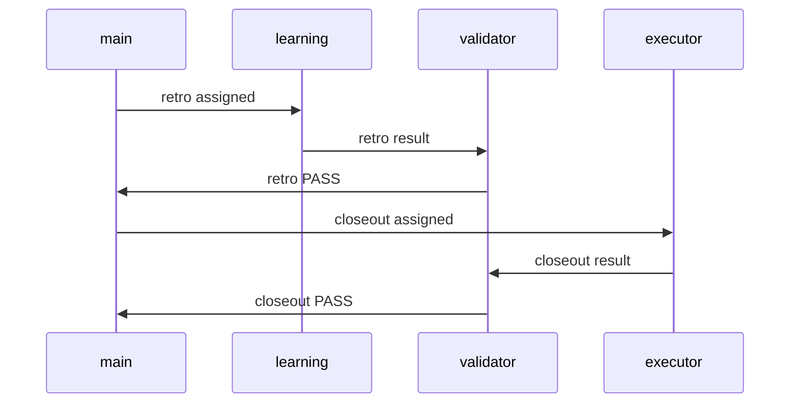
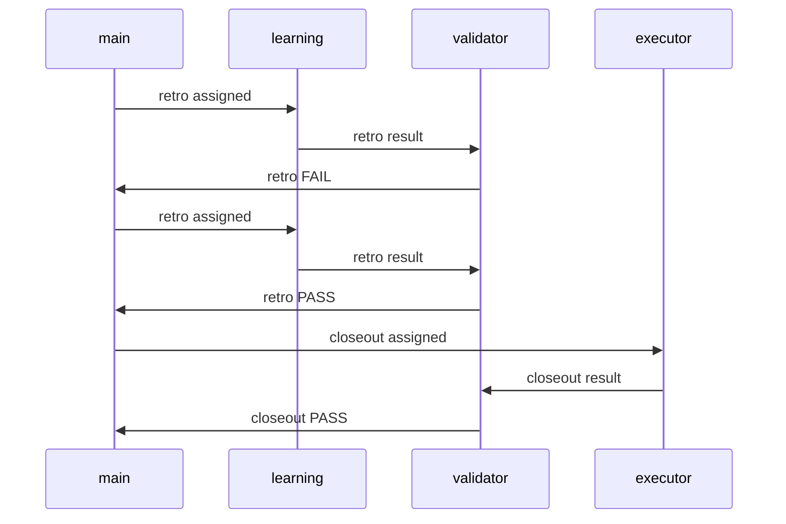
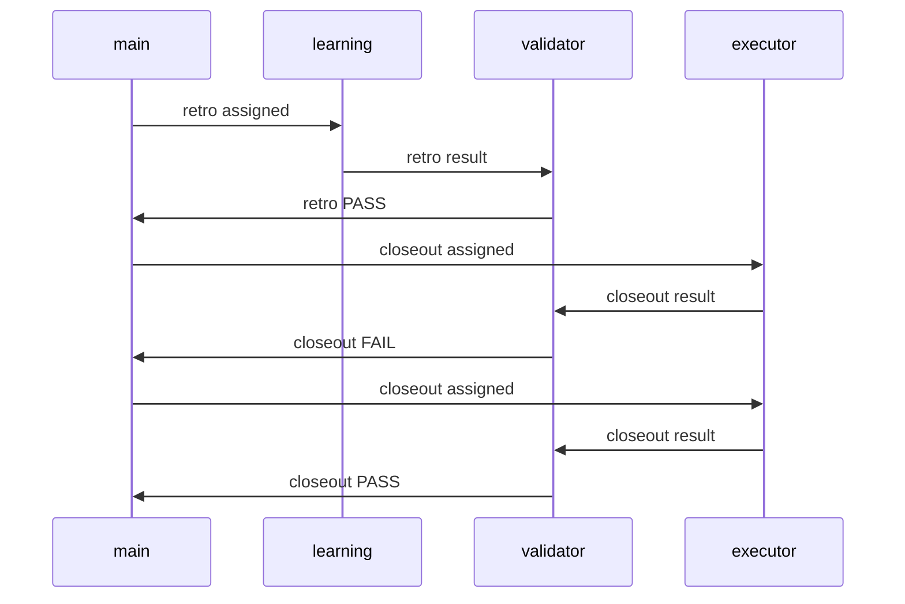
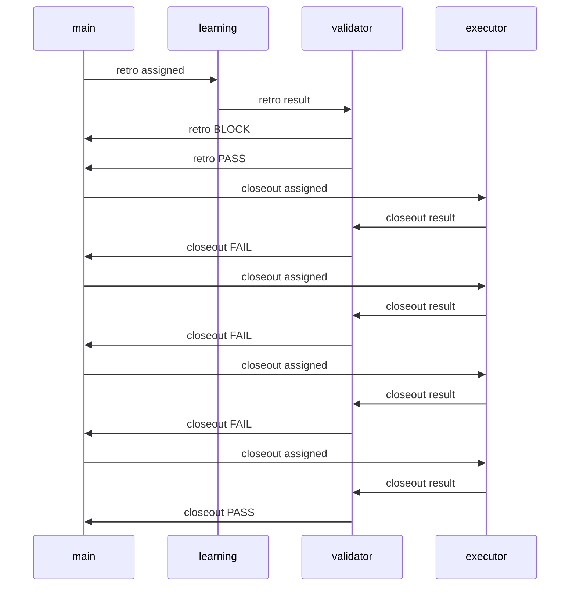
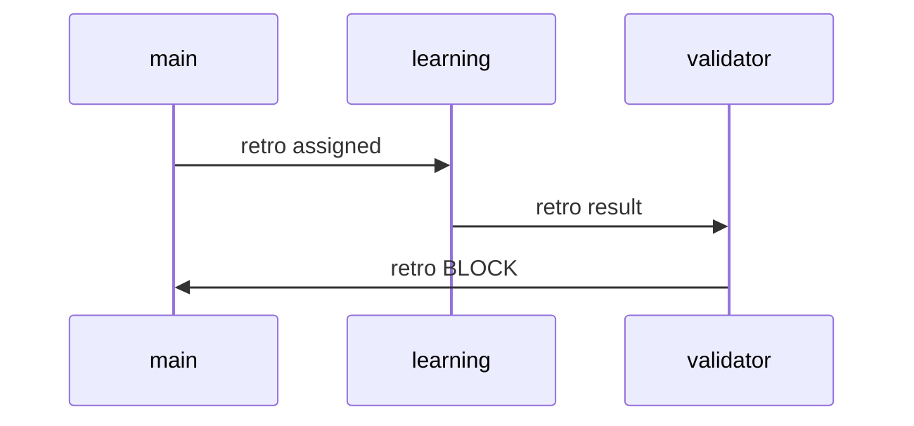
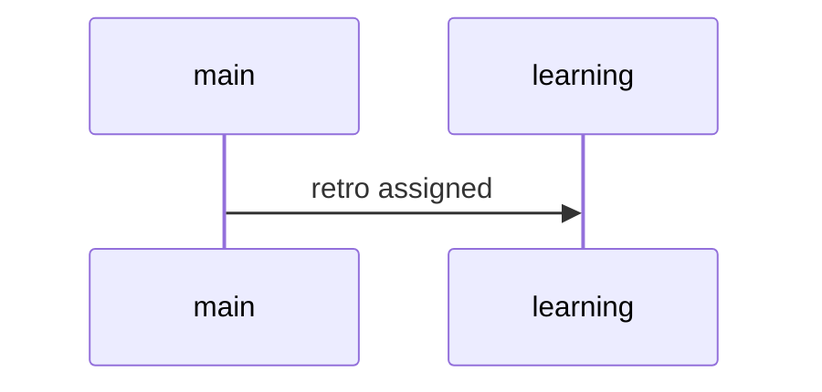

# Agent Workflow Summary

Updated: 2026-03-13T03:48:03.101Z

## Owner Load
- validator: 10 branches
- learning: 2 branches

## 管理模式完整主链 live smoke v7
- task_id: mgmt-execute-smoke-20260313-live7
- status: archived
- updated_at: 2026-03-13T03:22:29.044Z

Branches:
- closeout | owner=validator | route=default | status=pass
- retro | owner=validator | route=strategy_review | status=pass

## 管理模式完整主链 live smoke v6
- task_id: mgmt-execute-smoke-20260313-live6
- status: archived
- updated_at: 2026-03-13T03:04:16.930Z

Branches:
- closeout | owner=validator | route=default | status=pass
- retro | owner=validator | route=strategy_review | status=pass

## 管理模式完整主链 live smoke v5
- task_id: mgmt-execute-smoke-20260313-live5
- status: archived
- updated_at: 2026-03-13T03:00:31.814Z

Branches:
- closeout | owner=validator | route=default | status=pass
- retro | owner=validator | route=strategy_review | status=pass

## 管理模式完整主链 live smoke v4
- task_id: mgmt-execute-smoke-20260313-live4
- status: archived
- updated_at: 2026-03-13T02:49:50.159Z

Branches:
- closeout | owner=validator | route=default | status=pass
- retro | owner=validator | route=strategy_review | status=pass

## 管理模式完整主链 live smoke v3
- task_id: mgmt-execute-smoke-20260313-live3
- status: blocked
- updated_at: 2026-03-13T02:30:09.391Z

Branches:
- retro | owner=validator | route=strategy_review | status=block

## 管理模式完整主链 live smoke v2
- task_id: mgmt-execute-smoke-20260313-live2
- status: blocked
- updated_at: 2026-03-13T02:25:38.907Z

Branches:
- retro | owner=validator | route=strategy_review | status=block

## 管理模式完整主链 live smoke
- task_id: mgmt-execute-smoke-20260313-live
- status: in_progress
- updated_at: 2026-03-13T02:15:43.147Z

Branches:
- retro | owner=learning | route=strategy_review | status=running

## mgmt-handoff-smoke-20260313
- task_id: mgmt-handoff-smoke-20260313
- status: assigned
- updated_at: 2026-03-13T00:30:17.312Z

Branches:
- retro | owner=learning | route=strategy_review | status=assigned

